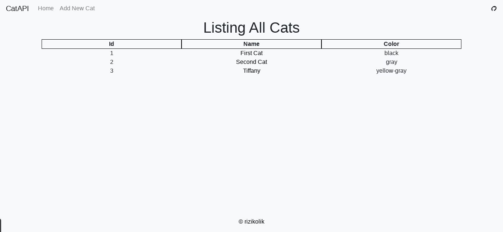
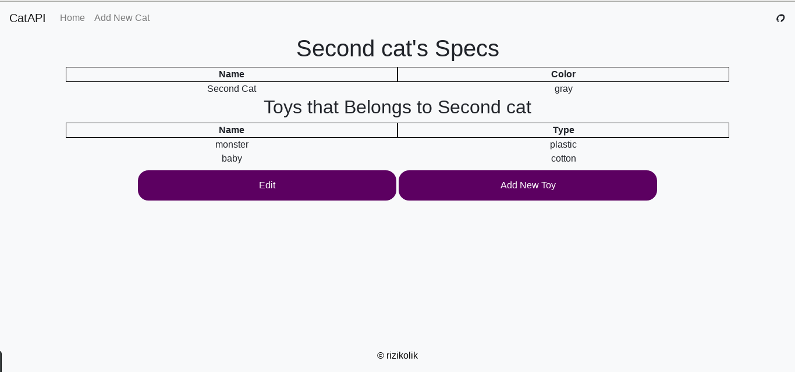
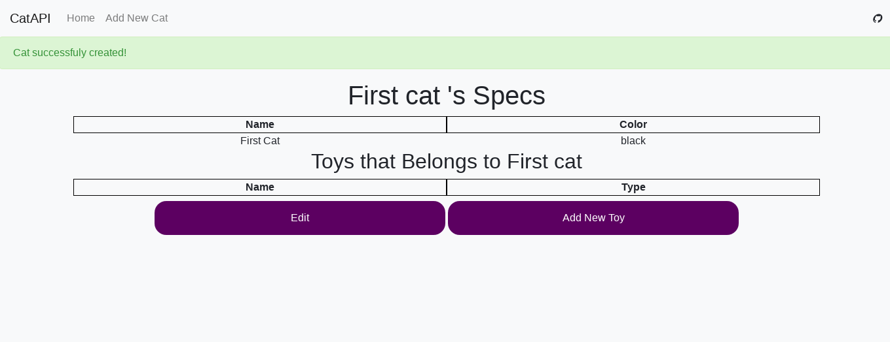
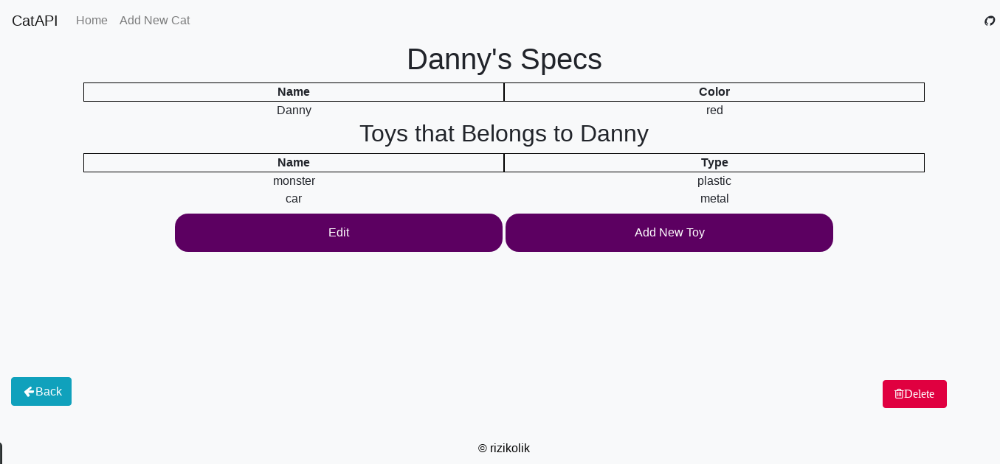

# CatAPI

Cat API is a basic rails app that helped me to build my skills .

<p align="center">
  
</p>

<p align="center">

</p>

<p align="center">
  
</p>
<p align="center">
  
</p>

## Usage

<details><summary><b>Show instructions</b></summary>

1. Install the the app:

   ```sh
   $ bundle install
   ```

2) How to see project:

   ```sh
   $ bundle exec rails s
   go to localhost of your machine
   ```

</details>

## Used Stacks and Methods:

1. Ruby and Ruby on Rails
2. Postgresql for storing data .
3. Restful
4. Bootstrap
5. Font Awesome
6. Flash Messages for Notifications
7. Sass
8. Erb and Views in Rails
